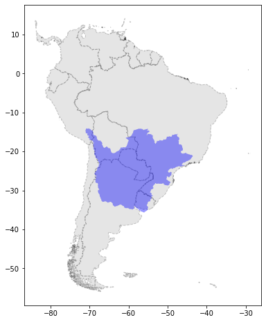
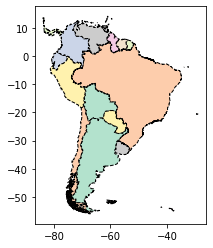
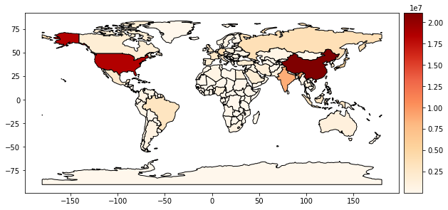
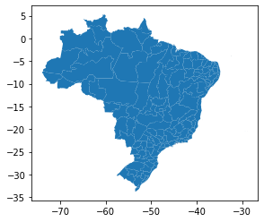
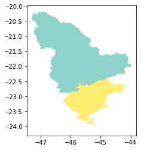
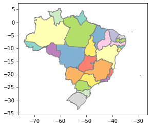
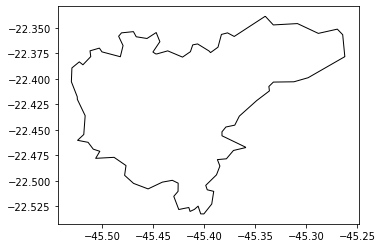
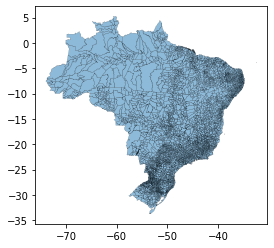

<a href="https://colab.research.google.com/gist/Robson-Passos/7d59dce27d9a00cd0f5b6bb37792e07b/untitled0.ipynb" target="_parent"></a>


```
import numpy as np
import matplotlib.pyplot as plt
import math
import geopandas as gpd
```


```
limite_as = gpd.read_file('lim_pais_a.shp')
limite_bacias = gpd.read_file('GEOFT_BHO_REF_ACH_n1.shp')
```


```
limite_as.head()
```


<div>
<style scoped>
    .dataframe tbody tr th:only-of-type {
        vertical-align: middle;
    }

    .dataframe tbody tr th {
        vertical-align: top;
    }

    .dataframe thead th {
        text-align: right;
    }
</style>
<table border="1" class="dataframe">
  <thead>
    <tr style="text-align: right;">
      <th></th>
      <th>nome</th>
      <th>nomeabrev</th>
      <th>geometriaa</th>
      <th>sigla</th>
      <th>codiso3166</th>
      <th>id_produto</th>
      <th>id_element</th>
      <th>geometry</th>
    </tr>
  </thead>
  <tbody>
    <tr>
      <th>0</th>
      <td>Brasil</td>
      <td>None</td>
      <td>Não</td>
      <td>BR</td>
      <td>BRA</td>
      <td>250000</td>
      <td>None</td>
      <td>MULTIPOLYGON (((-28.85365 -20.47547, -28.85372...</td>
    </tr>
    <tr>
      <th>1</th>
      <td>Chile</td>
      <td>None</td>
      <td>Não</td>
      <td>None</td>
      <td>CHL</td>
      <td>250000</td>
      <td>None</td>
      <td>MULTIPOLYGON (((-67.24908 -55.97526, -67.27164...</td>
    </tr>
    <tr>
      <th>2</th>
      <td>Ecuador</td>
      <td>None</td>
      <td>Não</td>
      <td>None</td>
      <td>ECU</td>
      <td>250000</td>
      <td>None</td>
      <td>MULTIPOLYGON (((-80.07488 -2.93137, -80.08265 ...</td>
    </tr>
    <tr>
      <th>3</th>
      <td>Falkland Islands/Malvinas</td>
      <td>None</td>
      <td>Não</td>
      <td>None</td>
      <td>FLK</td>
      <td>250000</td>
      <td>None</td>
      <td>MULTIPOLYGON (((-39.10368 -53.97896, -39.04586...</td>
    </tr>
    <tr>
      <th>4</th>
      <td>Panamá</td>
      <td>None</td>
      <td>Não</td>
      <td>None</td>
      <td>PAN</td>
      <td>250000</td>
      <td>None</td>
      <td>MULTIPOLYGON (((-81.78940 7.27305, -81.79500 7...</td>
    </tr>
  </tbody>
</table>
</div>


```
fig = plt.figure(figsize=(10,8))
ax = fig.add_subplot(111)
limite_as.plot(ax=ax, color='grey', alpha=0.2, linestyle='--', linewidth=1,
               edgecolor='k')
limite_bacias[8:9].plot(ax=ax, color='b', alpha=0.4)

#import matplotlib.patches as mpatches
#red_patch = mpatches.Patch(color='b', alpha=0.4, label='Bacia do Rio Paraná')
#plt.legend(handles=[red_patch], frameon=False, fontsize=12)
```


    <matplotlib.axes._subplots.AxesSubplot at 0x7f922f29c6d8>





```
limite_as.plot(cmap='Pastel2', column='nome', linestyle='--', linewidth=1, edgecolor='k')
```


    <matplotlib.axes._subplots.AxesSubplot at 0x7f922bc3d588>





```
world = gpd.read_file(gpd.datasets.get_path('naturalearth_lowres'))
```


```
world.head()
```


<div>
<style scoped>
    .dataframe tbody tr th:only-of-type {
        vertical-align: middle;
    }

    .dataframe tbody tr th {
        vertical-align: top;
    }

    .dataframe thead th {
        text-align: right;
    }
</style>
<table border="1" class="dataframe">
  <thead>
    <tr style="text-align: right;">
      <th></th>
      <th>pop_est</th>
      <th>continent</th>
      <th>name</th>
      <th>iso_a3</th>
      <th>gdp_md_est</th>
      <th>geometry</th>
    </tr>
  </thead>
  <tbody>
    <tr>
      <th>0</th>
      <td>920938</td>
      <td>Oceania</td>
      <td>Fiji</td>
      <td>FJI</td>
      <td>8374.0</td>
      <td>MULTIPOLYGON (((180.00000 -16.06713, 180.00000...</td>
    </tr>
    <tr>
      <th>1</th>
      <td>53950935</td>
      <td>Africa</td>
      <td>Tanzania</td>
      <td>TZA</td>
      <td>150600.0</td>
      <td>POLYGON ((33.90371 -0.95000, 34.07262 -1.05982...</td>
    </tr>
    <tr>
      <th>2</th>
      <td>603253</td>
      <td>Africa</td>
      <td>W. Sahara</td>
      <td>ESH</td>
      <td>906.5</td>
      <td>POLYGON ((-8.66559 27.65643, -8.66512 27.58948...</td>
    </tr>
    <tr>
      <th>3</th>
      <td>35623680</td>
      <td>North America</td>
      <td>Canada</td>
      <td>CAN</td>
      <td>1674000.0</td>
      <td>MULTIPOLYGON (((-122.84000 49.00000, -122.9742...</td>
    </tr>
    <tr>
      <th>4</th>
      <td>326625791</td>
      <td>North America</td>
      <td>United States of America</td>
      <td>USA</td>
      <td>18560000.0</td>
      <td>MULTIPOLYGON (((-122.84000 49.00000, -120.0000...</td>
    </tr>
  </tbody>
</table>
</div>


```
data = world.loc[:, ['name', 'iso_a3', 'gdp_md_est', 'geometry']].copy()
```


```
from mpl_toolkits.axes_grid1 import make_axes_locatable

fig, ax = plt.subplots(1, 1, figsize=(10, 8))

divider = make_axes_locatable(ax)

cax = divider.append_axes("right", size="5%", pad=0.1)

data.plot(column='gdp_md_est', cmap='OrRd', linewidth=1, edgecolor='k', legend=True, ax=ax, cax=cax)
```


    <matplotlib.axes._subplots.AxesSubplot at 0x7f922b40c128>





```
# Mesorregiões
meso = gpd.read_file('BRMEE250GC_SIR.shp')
```


```
meso.head()
```


<div>
<style scoped>
    .dataframe tbody tr th:only-of-type {
        vertical-align: middle;
    }

    .dataframe tbody tr th {
        vertical-align: top;
    }

    .dataframe thead th {
        text-align: right;
    }
</style>
<table border="1" class="dataframe">
  <thead>
    <tr style="text-align: right;">
      <th></th>
      <th>NM_MESO</th>
      <th>CD_GEOCME</th>
      <th>geometry</th>
    </tr>
  </thead>
  <tbody>
    <tr>
      <th>0</th>
      <td>VALE SÃO-FRANCISCANO DA BAHIA</td>
      <td>2902</td>
      <td>POLYGON ((-43.91589 -10.39308, -43.91479 -10.3...</td>
    </tr>
    <tr>
      <th>1</th>
      <td>SUL CATARINENSE</td>
      <td>4206</td>
      <td>MULTIPOLYGON (((-48.60210 -28.35256, -48.60215...</td>
    </tr>
    <tr>
      <th>2</th>
      <td>OESTE POTIGUAR</td>
      <td>2401</td>
      <td>MULTIPOLYGON (((-37.04412 -4.81854, -37.04501 ...</td>
    </tr>
    <tr>
      <th>3</th>
      <td>CENTRO GOIANO</td>
      <td>5203</td>
      <td>POLYGON ((-49.93862 -15.74910, -49.93984 -15.7...</td>
    </tr>
    <tr>
      <th>4</th>
      <td>SUDESTE PARANAENSE</td>
      <td>4109</td>
      <td>POLYGON ((-50.96336 -25.68256, -50.96464 -25.6...</td>
    </tr>
  </tbody>
</table>
</div>


```
meso.plot()
```


    <matplotlib.axes._subplots.AxesSubplot at 0x7f922b313748>





```
meso1 = meso.loc[meso.NM_MESO.isin(['VALE DO PARAÍBA PAULISTA', 'SUL/SUDOESTE DE MINAS'])]
```


```
meso1
```


<div>
<style scoped>
    .dataframe tbody tr th:only-of-type {
        vertical-align: middle;
    }

    .dataframe tbody tr th {
        vertical-align: top;
    }

    .dataframe thead th {
        text-align: right;
    }
</style>
<table border="1" class="dataframe">
  <thead>
    <tr style="text-align: right;">
      <th></th>
      <th>NM_MESO</th>
      <th>CD_GEOCME</th>
      <th>geometry</th>
    </tr>
  </thead>
  <tbody>
    <tr>
      <th>79</th>
      <td>VALE DO PARAÍBA PAULISTA</td>
      <td>3513</td>
      <td>MULTIPOLYGON (((-45.66346 -24.08258, -45.66339...</td>
    </tr>
    <tr>
      <th>105</th>
      <td>SUL/SUDOESTE DE MINAS</td>
      <td>3110</td>
      <td>POLYGON ((-46.51184 -21.56538, -46.51181 -21.5...</td>
    </tr>
  </tbody>
</table>
</div>


```
meso1.plot(column='NM_MESO', cmap='Set3')
```


    <matplotlib.axes._subplots.AxesSubplot at 0x7f922b0c7d68>





```
uf = gpd.read_file('lim_unidade_federacao_a.shp')
```


```
uf.head()
```


<div>
<style scoped>
    .dataframe tbody tr th:only-of-type {
        vertical-align: middle;
    }

    .dataframe tbody tr th {
        vertical-align: top;
    }

    .dataframe thead th {
        text-align: right;
    }
</style>
<table border="1" class="dataframe">
  <thead>
    <tr style="text-align: right;">
      <th></th>
      <th>nome</th>
      <th>nomeabrev</th>
      <th>geometriaa</th>
      <th>sigla</th>
      <th>geocodigo</th>
      <th>id_produto</th>
      <th>id_element</th>
      <th>geometry</th>
    </tr>
  </thead>
  <tbody>
    <tr>
      <th>0</th>
      <td>Bahia</td>
      <td>Bahia</td>
      <td>Não</td>
      <td>BA</td>
      <td>29</td>
      <td>250014.0</td>
      <td>None</td>
      <td>MULTIPOLYGON (((-38.71080 -17.96966, -38.70848...</td>
    </tr>
    <tr>
      <th>1</th>
      <td>Pará</td>
      <td>None</td>
      <td>None</td>
      <td>PA</td>
      <td>15</td>
      <td>NaN</td>
      <td>None</td>
      <td>MULTIPOLYGON (((-46.45928 -0.90961, -46.45936 ...</td>
    </tr>
    <tr>
      <th>2</th>
      <td>Rio de Janeiro</td>
      <td>None</td>
      <td>None</td>
      <td>RJ</td>
      <td>33</td>
      <td>250000.0</td>
      <td>None</td>
      <td>MULTIPOLYGON (((-43.55929 -23.08050, -43.55938...</td>
    </tr>
    <tr>
      <th>3</th>
      <td>São Paulo</td>
      <td>None</td>
      <td>None</td>
      <td>SP</td>
      <td>35</td>
      <td>250000.0</td>
      <td>None</td>
      <td>MULTIPOLYGON (((-45.13777 -23.79018, -45.13777...</td>
    </tr>
    <tr>
      <th>4</th>
      <td>Espírito Santo</td>
      <td>None</td>
      <td>None</td>
      <td>ES</td>
      <td>32</td>
      <td>250000.0</td>
      <td>None</td>
      <td>MULTIPOLYGON (((-28.85365 -20.47547, -28.85372...</td>
    </tr>
  </tbody>
</table>
</div>


```
uf.plot(column='nome', cmap='Set3', linewidth=1, edgecolor='grey')
```


    <matplotlib.axes._subplots.AxesSubplot at 0x7f922a59f208>





```
mun = gpd.read_file('Municipios_BRASIL_SIRGAS2000.shp')
```


```
itajuba = mun.loc[mun.nome.isin(['Itajubá'])]
```


```
itajuba.plot(edgecolor='k', facecolor='none')
```


    <matplotlib.axes._subplots.AxesSubplot at 0x7f9229fc3828>





```
mun.plot(alpha=0.5, edgecolor='k', linewidth=0.2)
```


    <matplotlib.axes._subplots.AxesSubplot at 0x7f922c019240>





```

```
